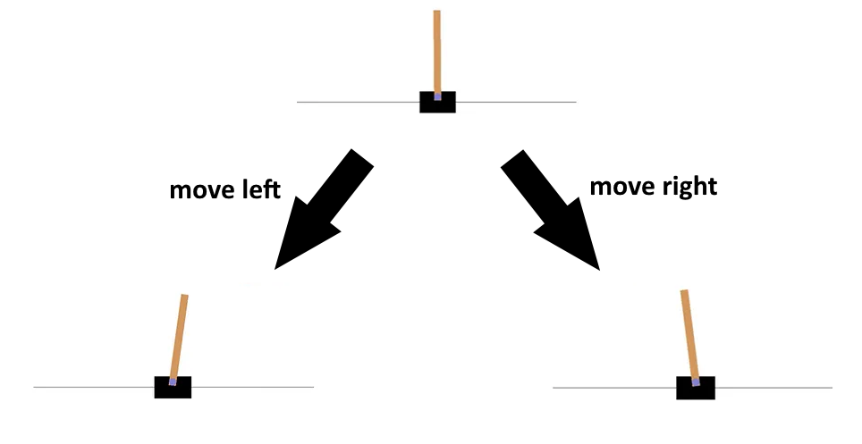

# Cart pole reinforcement learning
### An introduction to Deep Q-Learning

## A description of the problem

The cart pole problem is a classic reinforcement learning problem. The goal is to balance a pole on a cart by moving the cart left or right. The pole is attached to the cart by a hinge and the pole is free to rotate. The cart is free to move along a frictionless track.

## Q-Learning

### States
The current condition that the cart pole is in, is referred to as the 'state'.
The state includes the following properties:
- The position of the cart
- The velocity of the cart
- The angle of the pole
- The angular velocity of the pole

Depending on the action taken by the agent (the AI), the state will change. For example, if the agent moves the cart to the right, the position of the cart will increase, which results in a new state. Any action taken by the agent will result in a new state.

### Rewards
The goal of the game is to stay alive as long as possible. The longer the pole is held upright correctly, the higher the reward. The agent (the AI) is given the reward to let it know if its actions are good or not. As a result, the agent will learn to maximise the reward and try to pick the best actions. Possible deaths for the agent include:
- The pole falling over (it exceeds 12 degrees from vertical)
- The cart moving more than 2.4 units away from the center

## Implementations

### Barebones 
The barebones implementation is a simple implementation of the cart pole problem. It uses a simple Q-table to store the Q-values for each state-action pair that is generated and optimized during training. The Q-table is then used to determine the best action to take in a given state during 'run-time'.

### Pytorch
This implementation uses Pytorch to create a neural network that is used to approximate the Q-values for each state-action pair. The neural network is trained using a replay buffer and a target network. 

- The replay buffer is used to store the state-action pairs that are generated during training. 

- The target network is used to calculate the target Q-values for each state-action pair. The target Q-values are then used to calculate the loss for the neural network. The loss is then used to update the neural network.

The implementation was created by following the tutorial listed on the Pytorch [website](https://pytorch.org/tutorials/intermediate/reinforcement_q_learning.html)
